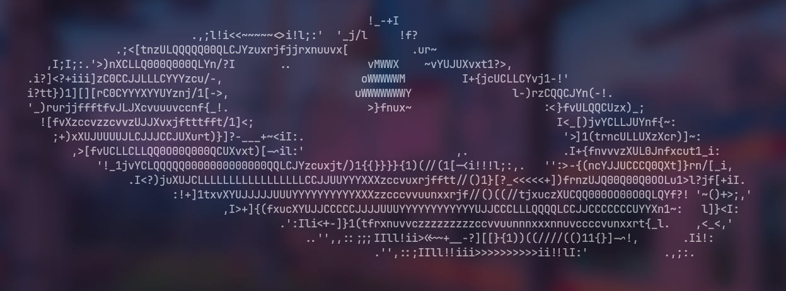

# ASCII Generator


A powerful, cross-platform command-line tool written in C++ to convert static images into high-quality ASCII art. It offers a range of options for fine-tuning the output, from brightness and contrast adjustments to custom character sets.

## Features

*   **Versatile Image Support**: Converts common image formats (JPEG, PNG, BMP, TGA, etc.) into text-based art.
*   **Customizable Dimensions**: Adjust the output `width` and `height` to fit any terminal size.
*   **Image Adjustments**: Fine-tune the final look with `brightness`, `contrast`, and `gamma` controls.
*   **Rich Character Sets**: Choose from three pre-defined character sets for varying levels of detail, or provide your own `custom_charset`.
*   **Smart Cropping**: Automatically crops the image to remove unnecessary empty space and focus on the main subject.
*   **Aspect Ratio Correction**: Adjust the character aspect ratio to prevent stretched or squashed output.

## Installation

### Prerequisites

*   A C++17 compatible compiler (e.g., GCC, Clang, MSVC)
*   CMake (version 3.16 or higher)
*   Git

### Easy Install (Linux/macOS)

An installation script is provided to simplify the build and install process.

1.  **Clone the repository:**
    ```bash
    git clone https://github.com/StupidAfCoder/Ascii-generator.git
    cd Ascii-generator
    ```

2.  **Run the install script:**
    ```bash
    ./scripts/install.sh
    ```

    The script will compile the project and install the `ascii-generator` executable to `~/.local/bin`. If this directory is not in your `PATH`, the script will offer to add it for you.

## Usage

Once installed, you can use the tool from your terminal.

### Basic Example

To convert an image with default settings:
```bash
ascii-generator -i /path/to/your/image.png
```

### Advanced Example

To generate ASCII art with a specific width, increased contrast, and a medium-detail character set:
```bash
ascii-generator -i image.jpg -w 120 -c 1.8 --charset 2
```

### Command-Line Options

| Flag | Shorthand | Description | Default |
|---|---|---|---|
| `--input` | `-i` | The path to the input image file. **(Required)** | |
| `--width` | `-w` | The desired width of the output ASCII art in characters. | `150` |
| `--height` | `-ht`| The desired height of the output. If `0`, height is calculated automatically based on the width and aspect ratio. | `0` |
| `--charset` | `-ch` | The level of detail for the character set. Options: `1` (Low), `2` (Medium), `3` (High). | `3` |
| `--custom_charset`| `-cu`| A string of characters to use for the ASCII ramp, from dark to light. | |
| `--brightness` | `-b` | Adjusts the brightness of the output. | `0.5` |
| `--contrast` | `-c` | Adjusts the contrast of the output. | `1.5` |
| `--gamma` | `-g` | Adjusts the gamma correction of the output. | `1.0` |
| `--char_aspect`|`-ca` | Adjusts the character aspect ratio to correct image proportions. | `0.65` |
| `--version` | `-v` | Display the application version. | |
| `--help` | `-h` | Display the help message. | |

**Note:** You cannot use `--charset` and `--custom_charset` at the same time.

## Building from Source (Manual)

If you prefer to build the project manually, follow these steps.

1.  **Clone the repository:**
    ```bash
    git clone https://github.com/StupidAfCoder/Ascii-generator.git
    cd Ascii-generator
    ```

2.  **Configure with CMake:**
    ```bash
    cmake -S . -B build
    ```

3.  **Build the project:**
    ```bash
    cmake --build build
    ```

4.  **Run the executable:**
    The binary will be located in the `build` directory.
    ```bash
    ./build/ascii-generator -i /path/to/your/image.png
    ```

## How It Works

The generator follows a multi-step process to transform an image into ASCII art:

1.  **Image Loading**: The input image is loaded using `stb_image.h`.
2.  **Luminance Calculation**: Each pixel's sRGB color value is converted to a linear luminance value, which more accurately represents perceived brightness.
3.  **Smart Cropping**: The image is analyzed to find the bounding box of the most detailed areas, effectively cropping out empty or uninteresting backgrounds.
4.  **Resampling**: The cropped luminance data is downsampled into a smaller grid, where each cell's value is the average luminance of the corresponding pixel block in the original image.
5.  **Image Adjustments**: Brightness, contrast, and gamma corrections are applied to the resampled grid to enhance the final output.
6.  **Character Mapping**: Each value in the adjusted grid is mapped to a character from the selected character set, creating the final ASCII art.

## Dependencies

This project includes the following third-party header-only libraries:

*   [cxxopts](https://github.com/jarro2783/cxxopts) for command-line option parsing.
*   [stb_image.h](https://github.com/nothings/stb) for loading various image formats.
